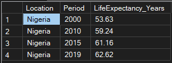
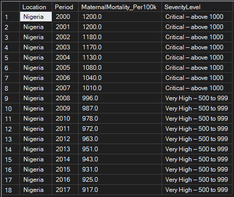
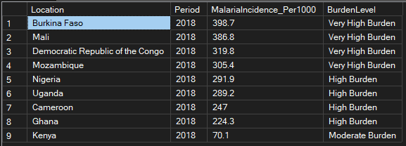
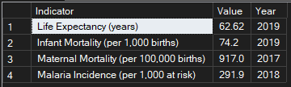

# Nigeria Health Indicators — SQL Analysis
### Microsoft SQL Server queries on WHO World 
### Health Statistics 2020 data

**Analyst:** Nwankwo Emmanuel  
**Tools:** Microsoft SQL Server · SSMS · SQL  
**Data Source:** WHO World Health Statistics 
2020 via Kaggle  
**GitHub:** [github.com/Emmapluz](https://github.com/Emmapluz)  
**Portfolio:** [View Portfolio](https://www.notion.so/Emmanuel-Nwankwo-Data-AI-Automation-Portfolio-34d2848d0dba80bd9f6fc5fd419f3c63)

---

## Project Overview

This project analyses four key Nigeria health 
indicators using SQL queries on WHO World Health 
Statistics 2020 data imported into Microsoft SQL 
Server. It is a follow-up to my Python EDA project 
on the same dataset — demonstrating the same data 
analysed using a completely different tool.

The four datasets imported into SQL Server:
- Life Expectancy at Birth
- Infant Mortality Rate
- Maternal Mortality Ratio
- Malaria Incidence

---

## Queries Built

**Query 1 — Nigeria Life Expectancy Trend**
SELECT with WHERE and ORDER BY showing 
Nigeria's life expectancy from 2000 to 2019.

**Query 2 — Top 10 Countries by Life Expectancy**
TOP N with ORDER BY showing global leaders 
in life expectancy in 2019.

**Query 3 — Nigeria vs African Countries**
CASE statement with subquery comparing Nigeria 
to nine other African countries against the 
global average.

**Query 4 — Maternal Mortality Classification**
CASE statement classifying Nigeria's maternal 
mortality severity level for each year 
from 2000 to 2017.

**Query 5 — Malaria Burden Comparison**
Subquery with CASE comparing malaria incidence 
across ten African countries in 2018.

**Query 6 — Nigeria Complete Health Profile**
UNION ALL across four tables showing Nigeria's 
latest available value for all four indicators 
in a single query result.

---

## Key Findings

| Indicator | Value | Year | Global Context |
|---|---|---|---|
| Life Expectancy | 62.62 years | 2019 | 22 years below Japan (84.26) |
| Infant Mortality | 74.2 per 1,000 | 2019 | ~3x global average |
| Maternal Mortality | 917 per 100,000 | 2017 | Critical level |
| Malaria Incidence | 291.9 per 1,000 | 2018 | 5th highest in Africa |

---

## Screenshots

---

## Related Projects

- [Python EDA — Nigeria Health Indicators]
(https://github.com/Emmapluz/nigeria-health-analysis)
- [Medium Article — WHO Health Analysis]
(https://medium.com/@e.u.nwankwo93/what-20-years-of-who-data-reveals-about-nigerias-health-cc19e92669c7)

---

## Data Source

WHO World Health Statistics 2020 via Kaggle:
https://www.kaggle.com/datasets/utkarshxy/who-worldhealth-statistics-2020-complete

---

## About the Analyst

Health educator transitioning into data analysis 
and AI automation. Background in health education 
and fintech operations (Moniepoint). Building 
expertise in Python, SQL, Power BI and n8n AI 
automation with a focus on health and finance.

- 📍 Lagos, Nigeria
- 💼 [LinkedIn](https://www.linkedin.com/in/emmanuel-uchenna-nwankwo)
- 🗂️ [Portfolio](https://www.notion.so/Emmanuel-Nwankwo-Data-AI-Automation-Portfolio-34d2848d0dba80bd9f6fc5fd419f3c63)
- 💻 [GitHub](https://github.com/Emmapluz)
